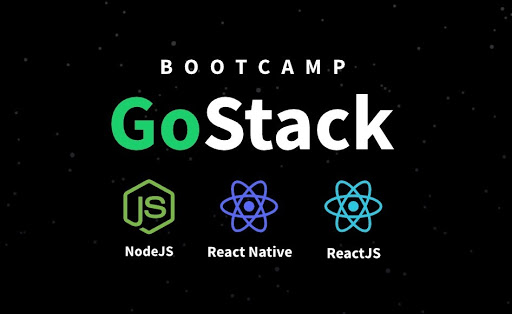

# 💻 Anotações do GoStack

<p align="center">
  
</p>

## Sumário

- [1. Primeiro projeto com React](#1-primeiro-projeto-com-React)

# 1. Primeiro projeto com React

## Estrutura e padrões

### Criando o projeto React

```jsx
	create-react-app 05-primeiro-projeto-react --template=typescript
```

[Padrões de projeto com ESLint, Prettier e EditorConfig ](https://www.notion.so/Padr-es-de-projeto-com-ESLint-Prettier-e-EditorConfig-0b57b47a24724c859c0cf226aa0cc3a7)

[Layout no Figma](https://www.figma.com/embed?embed_host=notion&url=https%3A%2F%2Fwww.figma.com%2Ffile%2FHOCmxfrElzLpI75LdzFLia%2FGithub-Explorer%3Fnode-id%3D0%253A1)

### Rodas

```jsx
yarn add react-router-dom
yarn add @types/react-router-dom -D
```

### Isolamento do CSS

```jsx
yarn add styled-components
yarn add @types/styled-components -D
```


---
Feito com 💜 por <a href="https://www.linkedin.com/in/hantonny-korrea-2853911a0/"><b>Hantonny Korrea</b></a>
